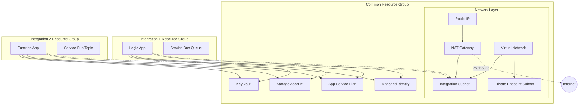

# Orch - Azure Integration Template Repository

A production-ready template repository for building Azure integration projects with Dynamics 365 Finance and Operations, following Azure Well-Architected Framework principles.

## Table of Contents

- [Overview](#overview)
- [Architecture](#architecture)
- [Prerequisites](#prerequisites)
- [Quick Start](#quick-start)
- [Testing & Validation](#testing--validation)
- [Project Structure](#project-structure)
- [Configuration](#configuration)
- [Deployment](#deployment)
- [Infrastructure Components](#infrastructure-components)
- [Best Practices](#best-practices)
- [Troubleshooting](#troubleshooting)

## Overview

This repository serves as a starting template for Azure integration projects, specifically designed for connecting to Dynamics 365 Finance and Operations. It provides Infrastructure as Code (IaC) using Bicep templates and automated deployments via GitHub Actions.

### Key Features

- **Modular Infrastructure**: Reusable Bicep modules for common Azure resources
- **Multi-Environment Support**: Separate configurations for dev, test, uat, and prod
- **Security First**: RBAC-based access control, managed identities, Key Vault integration
- **Automated Deployments**: GitHub Actions workflows with environment selection
- **Standardized Naming**: Consistent resource naming following Azure best practices
- **Cost Optimized**: Environment-specific SKUs to balance cost and performance

### Target Integrations

This template supports building integrations using:
- **Azure Logic Apps (Consumption)**: Workflow orchestration with pay-per-execution pricing
- **Azure Function Apps**: Custom processing logic (.NET isolated runtime)
- **Azure Service Bus**: Messaging with queues and topics
- **Azure Storage Accounts**: Blob containers, tables for data storage
- **Azure Key Vault**: Secrets management
- **Managed Identities**: Passwordless authentication

## Architecture

The infrastructure is organized into two layers:

### 1. Common Infrastructure Layer

Shared resources deployed to a common resource group, used across all integrations:

- **Virtual Network**: Isolated network environment with subnets
- **NAT Gateway**: Outbound connectivity with static public IP
- **Key Vault**: Centralized secrets management (auto-populated with storage connection string)
- **Storage Account**: Shared storage for integration files, logs, and configuration tables
- **App Service Plan**: Hosting platform for Function Apps and Logic Apps
- **Managed Identity**: Shared identity for simplified RBAC assignments
- **Application Insights**: Shared monitoring and telemetry
- **Log Analytics Workspace**: Centralized logging and diagnostics
- **API Connections**: Pre-configured Logic Apps connections to common storage tables

### 2. Integration Layer

Each integration has its own resource group containing:
- **Logic Apps (Consumption)**: Workflow orchestration
- **Function Apps**: Custom processing logic (.NET isolated)
- **Integration Key Vault**: Integration-specific secrets (isolated from common)
- **Function Storage Account**: Function App runtime storage
- **Integration Storage Account**: Integration data storage (containers, tables, queues)
- **Service Bus Namespace**: Integration-specific queues/topics
- **API Connections**: For Logic Apps to access storage (blob, tables)
- **References**: Uses shared common infrastructure (VNet, App Plan, Managed Identity)

### Integration Approaches

This repository supports two approaches for creating integrations:

**🆕 Recommended: Standard Integration Template** (`bicep/modules/standardIntegration.bicep`)
- Used by: SEPA and Nomentia integrations
- Benefits: Consistent infrastructure, reduced duplication, easier maintenance
- Just define parameters - no custom Bicep code needed
- See [Standard Integration Guide](bicep/modules/README-standardIntegration.md)

**Legacy: Custom Integration Template** (e.g., `sample-integration/main.bicep`)
- Used by: Sample integration (for educational purposes)
- Allows full customization of infrastructure
- Requires maintaining separate Bicep files
- Useful for complex integrations with unique requirements



## Prerequisites

Before using this template, ensure you have:

### Required Tools
- [Azure CLI](https://docs.microsoft.com/en-us/cli/azure/install-azure-cli) (v2.50.0 or later)
- [Bicep CLI](https://learn.microsoft.com/en-us/azure/azure-resource-manager/bicep/install) (installed with Azure CLI)
- [Git](https://git-scm.com/downloads)
- A code editor (VS Code recommended with Bicep extension)

### Azure Requirements
- Azure subscription(s) with appropriate permissions
  - Can use a single subscription for all environments
  - Or separate subscriptions per environment (recommended for production)
- Service Principal with Contributor role on all subscriptions
- Resource Provider registrations (on each subscription):
  - Microsoft.Web
  - Microsoft.Storage
  - Microsoft.KeyVault
  - Microsoft.ManagedIdentity
  - Microsoft.Network
  - Microsoft.ServiceBus (if using Service Bus)

### GitHub Requirements
- GitHub repository
- GitHub environments configured (dev, test, uat, prod)
- AZURE_CREDENTIALS secret set for each environment

## Quick Start

### 1. Clone the Template

```bash
git clone https://github.com/your-org/orch.git my-integration-project
cd my-integration-project
rm -rf .git
git init
```

### 2. Configure Azure Subscriptions

Edit `config/subscriptions.json` to map each environment to its Azure subscription:

```json
{
  "subscriptions": {
    "dev": {
      "subscriptionId": "xxxxxxxx-xxxx-xxxx-xxxx-xxxxxxxxxxxx",
      "subscriptionName": "Development Subscription"
    },
    "test": {
      "subscriptionId": "xxxxxxxx-xxxx-xxxx-xxxx-xxxxxxxxxxxx",
      "subscriptionName": "Test Subscription"
    },
    "uat": {
      "subscriptionId": "xxxxxxxx-xxxx-xxxx-xxxx-xxxxxxxxxxxx",
      "subscriptionName": "UAT Subscription"
    },
    "prod": {
      "subscriptionId": "yyyyyyyy-yyyy-yyyy-yyyy-yyyyyyyyyyyy",
      "subscriptionName": "Production Subscription"
    }
  }
}
```

**Note**: You can use the same subscription ID for all environments if you have a single subscription.

### 3. Configure Project Settings

Edit `config/settings.json` with your project details:

```json
{
  "project": {
    "customerName": "contoso",
    "projectName": "d365-integrations",
    "description": "Azure integration project for Dynamics 365 F&O"
  },
  "azure": {
    "location": "swedencentral",
    "locationShort": "sdc"
  },
  "naming": {
    "prefix": "contoso"
  }
}
```

### 4. Generate Parameter Files

Generate parameter files from your global settings:

```bash
# Generate all common infrastructure parameter files at once
./scripts/generate-common-params.sh
# Select: 5 (all)

# Or generate for a specific environment
./scripts/generate-common-params.sh
# Select: 1 (dev)
```

This automatically creates parameter files in `bicep/common/` for each environment, pulling values from `config/settings.json`. No manual editing required!

**Note:** These common infrastructure parameter files can be safely regenerated anytime. Integration-specific parameter files should be manually maintained. See [Parameter File Management Guide](docs/PARAMETER-FILE-MANAGEMENT.md) for details.

### 5. Set Up Azure Service Principal

Create a service principal with access to all required subscriptions:

```bash
az login

# If using a single subscription for all environments
az account set --subscription "your-subscription-id"

az ad sp create-for-rbac \
  --name "github-actions-orch" \
  --role contributor \
  --scopes /subscriptions/your-subscription-id \
  --sdk-auth
```

**For multiple subscriptions** (recommended), grant access to each:

```bash
# Create SP with access to first subscription (save the output!)
az ad sp create-for-rbac \
  --name "github-actions-orch" \
  --role contributor \
  --scopes /subscriptions/your-dev-subscription-id \
  --sdk-auth

# Get the App ID from the service principal
APP_ID=$(az ad sp list --display-name "github-actions-orch" --query "[0].appId" -o tsv)

# Assign contributor role to other subscriptions
az role assignment create --assignee $APP_ID --role contributor \
  --scope /subscriptions/your-test-subscription-id

az role assignment create --assignee $APP_ID --role contributor \
  --scope /subscriptions/your-uat-subscription-id

az role assignment create --assignee $APP_ID --role contributor \
  --scope /subscriptions/your-prod-subscription-id
```

Copy the JSON output from the first command.

### 6. Configure GitHub Secrets

1. Go to your GitHub repository
2. Navigate to Settings → Environments
3. Create environments: `dev`, `test`, `uat`, `prod`
4. For each environment, add a secret named `AZURE_CREDENTIALS` with the service principal JSON

**Important**: The same `AZURE_CREDENTIALS` secret can be used for all environments since the subscription is determined by `config/subscriptions.json`.

**⚠️ Troubleshooting:** If you get "No subscriptions found" error, the service principal doesn't have access to your subscriptions. See [GitHub Actions Troubleshooting Guide](docs/TROUBLESHOOTING-GITHUB-ACTIONS.md) for step-by-step solutions.

### 7. Test Before Deploying (Recommended)

**Always test your infrastructure before deploying!**

Run the comprehensive test script:

```bash
./scripts/test-deployment.sh
```

This will:
- ✅ Validate Bicep syntax
- ✅ Validate deployment against Azure
- ✅ Run **what-if analysis** (dry run - shows exactly what will change)
- ✅ Provide cost estimates
- ✅ No resources are created or modified

**Or use GitHub Actions What-If mode:**
1. Go to Actions → Deploy Common Infrastructure
2. Select environment
3. Check **"What-If"** option ✅
4. Review changes in job output

See [TESTING.md](docs/TESTING.md) for comprehensive testing guide.

### 8. Deploy Common Infrastructure

After testing, deploy via GitHub Actions:

1. Go to Actions tab in GitHub
2. Select "Deploy Common Infrastructure" workflow
3. Click "Run workflow"
4. Select environment (e.g., `dev`)
5. **Uncheck** "What-If" to deploy
6. Run the deployment

**Or deploy via Azure CLI:**

```bash
# Set subscription
SUBSCRIPTION_ID=$(jq -r '.subscriptions.dev.subscriptionId' config/subscriptions.json)
az account set --subscription "$SUBSCRIPTION_ID"

# Deploy
az deployment sub create \
  --location swedencentral \
  --template-file bicep/common/main.bicep \
  --parameters bicep/common/parameters.dev.json \
  --name common-infra-dev-$(date +%Y%m%d-%H%M%S)
```

### 9. Add Your First Integration

Once common infrastructure is deployed, you can create your first integration using the **standardized template approach**:

📘 **[See Standard Integration Guide →](bicep/modules/README-standardIntegration.md)**

**Quick Start:**
```bash
# 1. Create parameters file for your integration
mkdir -p bicep/integrations/my-integration
cat > bicep/integrations/my-integration/parameters.dev.json <<EOF
{
  "$schema": "https://schema.management.azure.com/schemas/2019-04-01/deploymentParameters.json#",
  "contentVersion": "1.0.0.0",
  "parameters": {
    "prefix": { "value": "yourprefix" },
    "environment": { "value": "dev" },
    "location": { "value": "swedencentral" },
    "locationShort": { "value": "sdc" },
    "integrationName": { "value": "my-integration" },
    "serviceBusQueues": {
      "value": [
        { "name": "my-queue", "maxDeliveryCount": 10 }
      ]
    },
    "integrationStorageContainers": {
      "value": [
        { "name": "input-files", "publicAccess": "None" }
      ]
    },
    "enableBlobApiConnection": { "value": true }
  }
}
EOF

# 2. Reference standardIntegration.bicep in your workflow
# Template: bicep/modules/standardIntegration.bicep
# Parameters: bicep/integrations/my-integration/parameters.dev.json

# 3. Deploy!
```

**Benefits of Standard Template:**
- ✅ No custom Bicep code needed
- ✅ Consistent infrastructure across all integrations
- ✅ Just define parameters for your specific needs
- ✅ Automatic updates when base template improves

### Existing Integrations

This repository includes the following integrations:

#### 1. SEPA Integration (Production)
- **Location**: `bicep/integrations/sepa/`
- **Approach**: Uses `standardIntegration.bicep` ✅
- **Workflow**: `.github/workflows/deploy-sepa-integration.yml`
- **Purpose**: SEPA payment processing integration

#### 2. Nomentia Integration (Production)
- **Location**: `bicep/integrations/nomentia/`
- **Approach**: Uses `standardIntegration.bicep` ✅
- **Workflow**: `.github/workflows/deploy-nomentia-integration.yml`
- **Documentation**: See `bicep/integrations/nomentia/README.md`
- **Purpose**: Nomentia system integration

#### 3. Sample Integration (Template/Reference)
- **Location**: `bicep/integrations/sample-integration/`
- **Approach**: Custom `main.bicep` (legacy approach)
- **Workflow**: `.github/workflows/deploy-sample-integration.yml`
- **Documentation**: See `bicep/integrations/sample-integration/README.md`
- **Purpose**: Educational reference showing end-to-end integration pattern

**Note**: For new integrations, use the **Standard Integration Template** approach as demonstrated by SEPA and Nomentia. The sample integration uses a custom approach for educational purposes to show how all components work together.

## Testing & Validation

### Quick Testing

```bash
# Comprehensive test with dry run
./scripts/test-deployment.sh

# Quick syntax validation only
./scripts/validate-bicep.sh
```

### What-If Analysis (Dry Run)

Preview exactly what changes will be made:

```bash
az deployment sub what-if \
  --location swedencentral \
  --template-file bicep/common/main.bicep \
  --parameters bicep/common/parameters.dev.json
```

### Testing Checklist

Before deploying to any environment:

- [ ] Run `./scripts/test-deployment.sh`
- [ ] Review all resources that will be created/modified
- [ ] Verify correct subscription is targeted
- [ ] Check resource naming matches expectations
- [ ] Review estimated costs
- [ ] Test in dev before prod

**See [docs/TESTING.md](docs/TESTING.md) for detailed testing guide.**

## Project Structure

```
Orch/
├── .github/
│   └── workflows/
│       ├── deploy-common-infra.yml         # Common infra deployment workflow
│       ├── deploy-sample-integration.yml   # Sample integration deployment
│       ├── deploy-sepa-integration.yml     # SEPA integration deployment
│       ├── deploy-nomentia-integration.yml # Nomentia integration deployment
│       ├── codeql.yml                      # CodeQL security analysis
│       └── nuget-vulnerability-scan.yml    # NuGet package vulnerability scanning
├── bicep/
│   ├── common/
│   │   ├── main.bicep                      # Main common infrastructure
│   │   ├── parameters.dev.json             # Dev environment parameters
│   │   ├── parameters.test.json            # Test environment parameters
│   │   ├── parameters.uat.json             # UAT environment parameters
│   │   └── parameters.prod.json            # Prod environment parameters
│   ├── integrations/
│   │   ├── sepa/                           # SEPA integration (production)
│   │   │   ├── parameters.*.json           # SEPA environment parameters
│   │   │   └── workflow-type.bicep         # SEPA-specific workflow type
│   │   ├── nomentia/                       # Nomentia integration (production)
│   │   │   ├── parameters.*.json           # Nomentia environment parameters
│   │   │   ├── workflow-type.bicep         # Nomentia-specific workflow type
│   │   │   └── README.md                   # Nomentia integration docs
│   │   └── sample-integration/             # Sample integration template
│   │       ├── main.bicep                  # Sample main template (legacy approach)
│   │       ├── parameters.*.json           # Sample parameters
│   │       ├── workflow-type.bicep         # Sample workflow type
│   │       ├── logicapps/                  # Sample Logic App workflows
│   │       └── README.md                   # Sample integration docs
│   └── modules/
│       ├── standardIntegration.bicep       # 🆕 Unified template for integrations
│       ├── naming.bicep                    # Naming convention module
│       ├── keyVault.bicep                  # Key Vault deployment
│       ├── keyVaultSecret.bicep            # Key Vault secret creation
│       ├── storageAccount.bicep            # Storage Account deployment
│       ├── storageKeySecret.bicep          # Storage key → Key Vault secret
│       ├── storageConnectionStringSecret.bicep  # Storage connection string → Key Vault
│       ├── managedIdentity.bicep           # Managed Identity deployment
│       ├── appServicePlan.bicep            # App Service Plan deployment
│       ├── functionApp.bicep               # Function App deployment
│       ├── logicApp.bicep                  # Logic App (Standard) deployment
│       ├── logicAppConsumption.bicep       # Logic App (Consumption) deployment
│       ├── apiConnection.bicep             # API Connection for Logic Apps
│       ├── serviceBus.bicep                # Service Bus namespace/queues/topics
│       ├── virtualNetwork.bicep            # Virtual Network with subnets
│       ├── natGateway.bicep                # NAT Gateway deployment
│       ├── publicIp.bicep                  # Public IP deployment
│       ├── applicationInsights.bicep       # Application Insights deployment
│       ├── logAnalyticsWorkspace.bicep     # Log Analytics Workspace
│       ├── actionGroup.bicep               # Action Group for alerts
│       ├── metricAlert.bicep               # Metric alert rules
│       ├── rbacAssignment.bicep            # RBAC role assignment
│       ├── restartFunctionApp.bicep        # Function App restart utility
│       ├── singleWorkflow.bicep            # Single Logic App workflow deployment
│       └── README-standardIntegration.md   # Standard integration guide
├── config/
│   ├── settings.json                       # Project configuration
│   └── subscriptions.json                  # Subscription mappings
├── docs/                                   # Additional documentation
├── scripts/
│   ├── generate-common-params.sh           # Generate common parameters
│   ├── generate-integration-params.sh      # Generate integration parameters
│   ├── create-integration-params.sh        # Create new integration parameters
│   ├── test-deployment.sh                  # Comprehensive testing
│   ├── validate-bicep.sh                   # Bicep validation
│   └── lib/                                # Shared script libraries
└── README.md                               # This file
```

## Configuration

### Settings Hierarchy

Configuration follows a hierarchy where global settings are defined once and reused:

```
config/settings.json (Global Settings - Source of Truth)
         ↓
   [Generate Scripts]
         ↓
bicep/common/parameters.{env}.json (Environment-specific overrides)
         ↓
   [Deployment]
```

**Key Principle**: Settings that are the same across all environments (customer name, project name, location, prefix) are defined in `config/settings.json`. Only environment-specific values (like SKUs, retention periods) are in parameter files.

### Settings File

The `config/settings.json` file is the **single source of truth** for project-wide configuration:

| Setting | Description | Example | Used By |
|---------|-------------|---------|---------|
| `project.customerName` | Customer identifier | `Contoso` | All parameter files (tags) |
| `project.projectName` | Project name | `D365 Integrations` | All parameter files (tags) |
| `azure.location` | Primary Azure region | `swedencentral` | All deployments |
| `azure.locationShort` | Region abbreviation | `sdc` | Resource naming |
| `naming.prefix` | Resource naming prefix | `contoso` | All resource names |
| `commonInfrastructure.*` | Infrastructure defaults | See file | Common infra parameters |

**Important**: After editing `config/settings.json`, regenerate parameter files:
```bash
./scripts/generate-common-params.sh  # For common infrastructure
./scripts/generate-integration-params.sh  # For integrations
```

### Environment-Specific Parameters

Each environment has its own parameter file with different configurations:

| Resource | Dev | Test/UAT | Prod |
|----------|-----|----------|------|
| Key Vault SKU | Standard | Standard | Premium |
| Storage SKU | Standard_LRS | Standard_LRS | Standard_GRS |
| App Service Plan | Y1 (Consumption) | EP1 (Elastic Premium) | EP1+ |
| Soft Delete Retention | 7 days | 30-90 days | 90 days |

## Deployment

### Deploy Common Infrastructure

The common infrastructure should be deployed first to create shared resources.

#### Using GitHub Actions (Recommended)

1. Navigate to Actions → Deploy Common Infrastructure
2. Click "Run workflow"
3. Select parameters:
   - **Environment**: dev/test/uat/prod
   - **What-If**: Enable to preview changes without deploying
4. Review deployment summary

#### Using Azure CLI

```bash
# Login to Azure
az login
az account set --subscription "your-subscription-id"

# Deploy to dev environment
az deployment sub create \
  --location swedencentral \
  --template-file bicep/common/main.bicep \
  --parameters bicep/common/parameters.dev.json

# What-if deployment (preview changes)
az deployment sub what-if \
  --location swedencentral \
  --template-file bicep/common/main.bicep \
  --parameters bicep/common/parameters.dev.json
```

### Deploy Integration

Integration deployments are available via GitHub Actions workflows:

**Using GitHub Actions (Recommended):**
1. Navigate to Actions tab
2. Select the integration workflow:
   - "Deploy SEPA Integration"
   - "Deploy Nomentia Integration"
   - "Deploy Sample Integration"
3. Click "Run workflow"
4. Select environment and options
5. Review deployment summary

**Using Azure CLI:**
```bash
# Example: Deploy SEPA integration using standardIntegration.bicep
az deployment sub create \
  --location swedencentral \
  --template-file bicep/modules/standardIntegration.bicep \
  --parameters bicep/integrations/sepa/parameters.dev.json \
  --name sepa-integration-dev-$(date +%Y%m%d-%H%M%S)

# Example: Deploy sample integration using custom main.bicep
az deployment sub create \
  --location swedencentral \
  --template-file bicep/integrations/sample-integration/main.bicep \
  --parameters bicep/integrations/sample-integration/parameters.dev.json
```

## Infrastructure Components

### Bicep Modules Overview

The repository includes specialized Bicep modules for different purposes:

#### Logic App Modules
- **`logicAppConsumption.bicep`**: Logic App (Consumption) tier - pay-per-execution, serverless
  - Use for: Most integrations with variable workload
  - Used by: Production integrations (SEPA, Nomentia)
- **`logicApp.bicep`**: Logic App (Standard) tier - dedicated hosting with App Service Plan
  - Use for: High-volume integrations requiring VNet integration
  - Note: Currently not used by active integrations
- **`singleWorkflow.bicep`**: Deploy individual workflow to existing Logic App
  - Use for: Adding workflows to Logic Apps post-deployment

#### Utility Modules
- **`restartFunctionApp.bicep`**: Restart Function App after deployment
  - Use for: Forcing configuration reload in CI/CD pipelines

### Key Vault

**Purpose**: Centralized secrets management for all integrations

**Features**:
- Access policy-based authorization (with managed identity access)
- Soft delete with configurable retention (7-90 days)
- Purge protection enabled in production
- Network ACLs with Azure Services bypass
- Diagnostic logging to Log Analytics
- **Auto-populated** with `blobConnectionString` secret for common storage

**Access**: Managed Identity has secrets `get`, `list`, and `set` permissions

**Automatic Secrets**:
- `blobConnectionString`: Connection string to common storage account (auto-created)

### Storage Account

**Purpose**: Shared storage for integration files, logs, and configuration data

**Features**:
- TLS 1.2 minimum
- Blob public access disabled
- Soft delete for blobs and containers (7 days)
- Default containers: `integration-files`, `logs`
- Default tables: `Configuration`, `Logs`

**Access**: Managed Identity has "Storage Blob Data Contributor" role

**API Connections**: Automatically creates Azure Tables API connection for Logic Apps

### App Service Plan

**Purpose**: Hosting platform for Function Apps and Logic Apps

**SKU Options**:
- **Y1 (Consumption)**: Pay-per-execution, ideal for dev/test with Function Apps
- **EP1-EP3 (Elastic Premium)**: Pre-warmed instances, VNet integration, better for production Function Apps
- **P1v2-P3v2 (Premium v2)**: Dedicated instances for production workloads

### Managed Identity

**Purpose**: Simplified authentication and authorization across Azure services

**Benefits**:
- No credential management
- Automatic credential rotation
- Pre-configured RBAC to Key Vault and Storage
- Can be assigned to Logic Apps, Function Apps, etc.

### Virtual Network

**Purpose**: Isolated network environment for integration resources

**Features**:
- Configurable address space (default: 10.x.0.0/16 per environment)
- Multiple subnets for different purposes
- Network security and isolation
- Support for service endpoints and delegations
- Private endpoint support

**Default Subnets**:
- **integration-subnet**: For hosting integration resources (Function Apps, Logic Apps)
- **private-endpoint-subnet**: For private endpoints to Azure services

### NAT Gateway

**Purpose**: Provides outbound internet connectivity with static public IP

**Features**:
- Static public IP address for outbound traffic
- Improved connection reliability
- SNAT port management
- Configurable idle timeout (4-120 minutes)
- Attached to integration subnet by default

**Benefits**:
- Predictable outbound IP address (useful for firewall whitelisting)
- Reduces SNAT port exhaustion
- Better for high-volume outbound connections

### Public IP Address

**Purpose**: Provides static public IP for NAT Gateway

**Features**:
- Standard SKU
- Static allocation
- Zone redundancy support (optional)
- DNS name label support

### Naming Conventions

All resources follow a consistent naming pattern:

**Standard Format** (with hyphens):
```
{prefix}-{environment}-{location}-{resource-type}
```

**Short Format** (no hyphens, for resources with character limits):
```
{prefix}{env-short}{loc-short}{resource-type}
```

**Examples** (using prefix `edmo`):
- Resource Group: `edmo-dev-common-rg`
- Key Vault: `edmodsctkv` (short format, no hyphens, max 24 chars)
- Storage Account: `edmodscst` (short format, lowercase, no hyphens)
- App Service Plan: `edmo-dev-sdc-plan`
- Virtual Network: `edmo-dev-sdc-vnet`
- NAT Gateway: `edmo-dev-sdc-nat`
- Public IP: `edmo-dev-sdc-pip`
- Managed Identity: `edmodscid` (short format)

**Integration-Specific** (includes workload name):
- Integration Key Vault: `edmodscsamplekv`
- Function Storage: `edmodscsamplest`
- Archive Storage: `edmodscsamplestarc`

**Environment Abbreviations**:
- `dev` → `d`, `test` → `t`, `uat` → `u`, `prod` → `p`

**Location Abbreviations**:
- `swedencentral` / `sdc` → `sc`
- `westeurope` / `weu` → `we`
- `northeurope` / `neu` → `ne`

Resource type abbreviations follow [Azure CAF standards](https://learn.microsoft.com/en-us/azure/cloud-adoption-framework/ready/azure-best-practices/resource-abbreviations).

## Best Practices

### Security

✅ **Do**:
- Use Managed Identities for authentication
- Store all secrets in Key Vault
- Enable RBAC on Key Vault (not access policies)
- Use private endpoints for production
- Enable diagnostic logging

❌ **Don't**:
- Store connection strings in code
- Use access keys when managed identity is available
- Disable soft delete on Key Vault
- Allow public blob access

### Cost Optimization

- Use Consumption (Y1) plans for dev/test environments
- Implement blob lifecycle policies for log retention
- Use Standard_LRS storage for non-production
- Tag all resources for cost tracking

### Reliability

- Enable zone redundancy for production App Service Plans
- Use geo-redundant storage (GRS) for production
- Implement retry policies in Logic Apps/Function Apps
- Monitor with Application Insights

### Operational Excellence

- Use consistent naming conventions
- Tag resources with environment, cost center, owner
- Document integration patterns
- Automate deployments via GitHub Actions
- Use What-If before production deployments

## Troubleshooting

### Common Issues

#### 1. Deployment Fails with "Resource Provider Not Registered"

**Solution**: Register the required resource providers:

```bash
az provider register --namespace Microsoft.Web
az provider register --namespace Microsoft.KeyVault
az provider register --namespace Microsoft.Storage
az provider register --namespace Microsoft.ManagedIdentity
```

#### 2. Key Vault Name Already Exists

**Issue**: Key Vault names are globally unique and soft-deleted vaults retain their name.

**Solution**: Either:
- Change the `prefix` in parameter files
- Purge the soft-deleted vault:
  ```bash
  az keyvault purge --name your-vault-name
  ```

#### 3. GitHub Actions Fails with Authentication Error

**Check**:
1. `AZURE_CREDENTIALS` secret is correctly formatted JSON
2. Service Principal has Contributor role
3. GitHub environment name matches workflow input

#### 4. Storage Account Name Invalid

**Issue**: Storage account names must be 3-24 characters, lowercase letters and numbers only.

**Solution**: Adjust the `prefix` to ensure generated names meet requirements.

### Getting Help

1. Check [Azure Bicep documentation](https://learn.microsoft.com/en-us/azure/azure-resource-manager/bicep/)
2. Review [GitHub Actions logs](https://docs.github.com/en/actions/monitoring-and-troubleshooting-workflows)
3. Validate templates locally:
   ```bash
   az bicep build --file bicep/common/main.bicep
   ```

## Next Steps

After deploying common infrastructure:

1. **Verify Resources**: Check Azure Portal for created resources
2. **Test Access**: Verify Managed Identity can access Key Vault and Storage
3. **Review Auto-Created Secrets**: Key Vault now contains `blobConnectionString` automatically
4. **Test API Connection**: Verify Logic Apps can connect to common storage tables
5. **Deploy First Integration**: See [Quick Start Guide for New Integrations](docs/QUICKSTART-NEW-INTEGRATION.md)
6. **Configure Monitoring**: Application Insights and Log Analytics are ready with default alerts

## Contributing

When contributing to this template:

1. Follow existing Bicep formatting and style
2. Update parameter files for all environments
3. Test deployments in dev environment first
4. Document any new modules or features
5. Update this README with new sections as needed

## License

This template is provided as-is for use within your organization.

---

**Version**: 2.1.0
**Last Updated**: 2025-10-26

## Changelog

### Version 2.1.0 (2025-10-26)
- 📝 **DOCUMENTATION**: Updated project structure to reflect actual implementation
- ✅ **DOCUMENTATION**: Documented SEPA and Nomentia production integrations
- 📚 **DOCUMENTATION**: Clarified standardIntegration.bicep usage patterns
- 🔍 **DOCUMENTATION**: Added documentation for additional Bicep modules (logicApp, restartFunctionApp, singleWorkflow)
- 🚀 **DOCUMENTATION**: Documented all GitHub Actions workflows including security scans
- 📋 **DOCUMENTATION**: Added create-integration-params.sh to scripts documentation

### Version 2.0.0 (2025-10-25)
- ✨ **NEW**: Unified `standardIntegration.bicep` template for integrations
- 🔄 **BREAKING**: Replaced integration-specific main.bicep files with parameterized approach
- 📝 Updated all documentation to reflect Logic Apps Consumption tier (not Standard)
- 🧹 Removed WS1-WS3 App Service Plan SKU references
- 📚 Added comprehensive Standard Integration Guide
