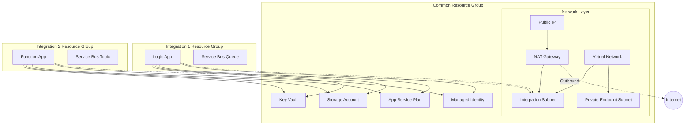

# Orch - Azure Integration Template Repository

A production-ready template repository for building Azure integration projects with Dynamics 365 Finance and Operations, following Azure Well-Architected Framework principles.

## Table of Contents

- [Overview](#overview)
- [Architecture](#architecture)
- [Prerequisites](#prerequisites)
- [Quick Start](#quick-start)
- [Testing & Validation](#testing--validation)
- [Project Structure](#project-structure)
- [Configuration](#configuration)
- [Deployment](#deployment)
- [Infrastructure Components](#infrastructure-components)
- [Best Practices](#best-practices)
- [Troubleshooting](#troubleshooting)

## Overview

This repository serves as a starting template for Azure integration projects, specifically designed for connecting to Dynamics 365 Finance and Operations. It provides Infrastructure as Code (IaC) using Bicep templates and automated deployments via GitHub Actions.

### Key Features

- **Modular Infrastructure**: Reusable Bicep modules for common Azure resources
- **Multi-Environment Support**: Separate configurations for dev, test, uat, and prod
- **Security First**: RBAC-based access control, managed identities, Key Vault integration
- **Automated Deployments**: GitHub Actions workflows with environment selection
- **Standardized Naming**: Consistent resource naming following Azure best practices
- **Cost Optimized**: Environment-specific SKUs to balance cost and performance

### Target Integrations

This template supports building integrations using:
- Azure Logic Apps (Standard)
- Azure Function Apps
- Azure Service Bus
- Azure Storage Accounts
- Azure Key Vault
- Managed Identities for secure authentication

## Architecture

The infrastructure is organized into two layers:

### 1. Common Infrastructure Layer

Shared resources deployed to a common resource group, used across all integrations:

- **Virtual Network**: Isolated network environment with subnets
- **NAT Gateway**: Outbound connectivity with static public IP
- **Key Vault**: Centralized secrets management with RBAC
- **Storage Account**: Shared storage for integration files and logs
- **App Service Plan**: Hosting platform for Function Apps and Logic Apps
- **Managed Identity**: Shared identity for simplified RBAC assignments

### 2. Integration Layer

Each integration has its own resource group containing:
- Logic Apps or Function Apps
- Integration-specific Service Bus queues/topics
- References to shared common resources



## Prerequisites

Before using this template, ensure you have:

### Required Tools
- [Azure CLI](https://docs.microsoft.com/en-us/cli/azure/install-azure-cli) (v2.50.0 or later)
- [Bicep CLI](https://learn.microsoft.com/en-us/azure/azure-resource-manager/bicep/install) (installed with Azure CLI)
- [Git](https://git-scm.com/downloads)
- A code editor (VS Code recommended with Bicep extension)

### Azure Requirements
- Azure subscription(s) with appropriate permissions
  - Can use a single subscription for all environments
  - Or separate subscriptions per environment (recommended for production)
- Service Principal with Contributor role on all subscriptions
- Resource Provider registrations (on each subscription):
  - Microsoft.Web
  - Microsoft.Storage
  - Microsoft.KeyVault
  - Microsoft.ManagedIdentity
  - Microsoft.Network
  - Microsoft.ServiceBus (if using Service Bus)

### GitHub Requirements
- GitHub repository
- GitHub environments configured (dev, test, uat, prod)
- AZURE_CREDENTIALS secret set for each environment

## Quick Start

### 1. Clone the Template

```bash
git clone https://github.com/your-org/orch.git my-integration-project
cd my-integration-project
rm -rf .git
git init
```

### 2. Configure Azure Subscriptions

Edit `config/subscriptions.json` to map each environment to its Azure subscription:

```json
{
  "subscriptions": {
    "dev": {
      "subscriptionId": "xxxxxxxx-xxxx-xxxx-xxxx-xxxxxxxxxxxx",
      "subscriptionName": "Development Subscription"
    },
    "test": {
      "subscriptionId": "xxxxxxxx-xxxx-xxxx-xxxx-xxxxxxxxxxxx",
      "subscriptionName": "Test Subscription"
    },
    "uat": {
      "subscriptionId": "xxxxxxxx-xxxx-xxxx-xxxx-xxxxxxxxxxxx",
      "subscriptionName": "UAT Subscription"
    },
    "prod": {
      "subscriptionId": "yyyyyyyy-yyyy-yyyy-yyyy-yyyyyyyyyyyy",
      "subscriptionName": "Production Subscription"
    }
  }
}
```

**Note**: You can use the same subscription ID for all environments if you have a single subscription.

### 3. Configure Project Settings

Edit `config/settings.json` with your project details:

```json
{
  "project": {
    "customerName": "contoso",
    "projectName": "d365-integrations",
    "description": "Azure integration project for Dynamics 365 F&O"
  },
  "azure": {
    "location": "westeurope",
    "locationShort": "weu"
  },
  "naming": {
    "prefix": "contoso"
  }
}
```

### 4. Generate Parameter Files

Generate parameter files from your global settings:

```bash
# Generate all common infrastructure parameter files at once
./scripts/generate-common-params.sh
# Select: 5 (all)

# Or generate for a specific environment
./scripts/generate-common-params.sh
# Select: 1 (dev)
```

This automatically creates parameter files in `bicep/common/` for each environment, pulling values from `config/settings.json`. No manual editing required!

### 5. Set Up Azure Service Principal

Create a service principal with access to all required subscriptions:

```bash
az login

# If using a single subscription for all environments
az account set --subscription "your-subscription-id"

az ad sp create-for-rbac \
  --name "github-actions-orch" \
  --role contributor \
  --scopes /subscriptions/your-subscription-id \
  --sdk-auth
```

**For multiple subscriptions** (recommended), grant access to each:

```bash
# Create SP with access to first subscription (save the output!)
az ad sp create-for-rbac \
  --name "github-actions-orch" \
  --role contributor \
  --scopes /subscriptions/your-dev-subscription-id \
  --sdk-auth

# Get the App ID from the service principal
APP_ID=$(az ad sp list --display-name "github-actions-orch" --query "[0].appId" -o tsv)

# Assign contributor role to other subscriptions
az role assignment create --assignee $APP_ID --role contributor \
  --scope /subscriptions/your-test-subscription-id

az role assignment create --assignee $APP_ID --role contributor \
  --scope /subscriptions/your-uat-subscription-id

az role assignment create --assignee $APP_ID --role contributor \
  --scope /subscriptions/your-prod-subscription-id
```

Copy the JSON output from the first command.

### 6. Configure GitHub Secrets

1. Go to your GitHub repository
2. Navigate to Settings → Environments
3. Create environments: `dev`, `test`, `uat`, `prod`
4. For each environment, add a secret named `AZURE_CREDENTIALS` with the service principal JSON

**Important**: The same `AZURE_CREDENTIALS` secret can be used for all environments since the subscription is determined by `config/subscriptions.json`.

### 7. Test Before Deploying (Recommended)

**Always test your infrastructure before deploying!**

Run the comprehensive test script:

```bash
./scripts/test-deployment.sh
```

This will:
- ✅ Validate Bicep syntax
- ✅ Validate deployment against Azure
- ✅ Run **what-if analysis** (dry run - shows exactly what will change)
- ✅ Provide cost estimates
- ✅ No resources are created or modified

**Or use GitHub Actions What-If mode:**
1. Go to Actions → Deploy Common Infrastructure
2. Select environment
3. Check **"What-If"** option ✅
4. Review changes in job output

See [TESTING.md](docs/TESTING.md) for comprehensive testing guide.

### 8. Deploy Common Infrastructure

After testing, deploy via GitHub Actions:

1. Go to Actions tab in GitHub
2. Select "Deploy Common Infrastructure" workflow
3. Click "Run workflow"
4. Select environment (e.g., `dev`)
5. **Uncheck** "What-If" to deploy
6. Run the deployment

**Or deploy via Azure CLI:**

```bash
# Set subscription
SUBSCRIPTION_ID=$(jq -r '.subscriptions.dev.subscriptionId' config/subscriptions.json)
az account set --subscription "$SUBSCRIPTION_ID"

# Deploy
az deployment sub create \
  --location westeurope \
  --template-file bicep/common/main.bicep \
  --parameters bicep/common/parameters.dev.json \
  --name common-infra-dev-$(date +%Y%m%d-%H%M%S)
```

## Testing & Validation

### Quick Testing

```bash
# Comprehensive test with dry run
./scripts/test-deployment.sh

# Quick syntax validation only
./scripts/validate-bicep.sh
```

### What-If Analysis (Dry Run)

Preview exactly what changes will be made:

```bash
az deployment sub what-if \
  --location westeurope \
  --template-file bicep/common/main.bicep \
  --parameters bicep/common/parameters.dev.json
```

### Testing Checklist

Before deploying to any environment:

- [ ] Run `./scripts/test-deployment.sh`
- [ ] Review all resources that will be created/modified
- [ ] Verify correct subscription is targeted
- [ ] Check resource naming matches expectations
- [ ] Review estimated costs
- [ ] Test in dev before prod

**See [docs/TESTING.md](docs/TESTING.md) for detailed testing guide.**

## Project Structure

```
Orch/
├── .github/
│   └── workflows/
│       └── deploy-common-infra.yml    # Common infra deployment workflow
├── bicep/
│   ├── common/
│   │   ├── main.bicep                  # Main common infrastructure
│   │   ├── parameters.dev.json         # Dev environment parameters
│   │   ├── parameters.test.json        # Test environment parameters
│   │   ├── parameters.uat.json         # UAT environment parameters
│   │   └── parameters.prod.json        # Prod environment parameters
│   ├── integrations/                   # Integration-specific templates
│   └── modules/
│       ├── naming.bicep                # Naming convention module
│       ├── keyVault.bicep              # Key Vault module
│       ├── storageAccount.bicep        # Storage Account module
│       ├── managedIdentity.bicep       # Managed Identity module
│       ├── appServicePlan.bicep        # App Service Plan module
│       └── rbacAssignment.bicep        # RBAC assignment module
├── config/
│   └── settings.json                   # Project configuration
├── docs/                               # Additional documentation
└── README.md                           # This file
```

## Configuration

### Settings Hierarchy

Configuration follows a hierarchy where global settings are defined once and reused:

```
config/settings.json (Global Settings - Source of Truth)
         ↓
   [Generate Scripts]
         ↓
bicep/common/parameters.{env}.json (Environment-specific overrides)
         ↓
   [Deployment]
```

**Key Principle**: Settings that are the same across all environments (customer name, project name, location, prefix) are defined in `config/settings.json`. Only environment-specific values (like SKUs, retention periods) are in parameter files.

### Settings File

The `config/settings.json` file is the **single source of truth** for project-wide configuration:

| Setting | Description | Example | Used By |
|---------|-------------|---------|---------|
| `project.customerName` | Customer identifier | `Contoso` | All parameter files (tags) |
| `project.projectName` | Project name | `D365 Integrations` | All parameter files (tags) |
| `azure.location` | Primary Azure region | `westeurope` | All deployments |
| `azure.locationShort` | Region abbreviation | `weu` | Resource naming |
| `naming.prefix` | Resource naming prefix | `contoso` | All resource names |
| `commonInfrastructure.*` | Infrastructure defaults | See file | Common infra parameters |

**Important**: After editing `config/settings.json`, regenerate parameter files:
```bash
./scripts/generate-common-params.sh  # For common infrastructure
./scripts/generate-integration-params.sh  # For integrations
```

### Environment-Specific Parameters

Each environment has its own parameter file with different configurations:

| Resource | Dev | Test/UAT | Prod |
|----------|-----|----------|------|
| Key Vault SKU | Standard | Standard | Premium |
| Storage SKU | Standard_LRS | Standard_LRS | Standard_GRS |
| App Service Plan | Y1 (Consumption) | EP1 (Elastic Premium) | EP1+ |
| Soft Delete Retention | 7 days | 30-90 days | 90 days |

## Deployment

### Deploy Common Infrastructure

The common infrastructure should be deployed first to create shared resources.

#### Using GitHub Actions (Recommended)

1. Navigate to Actions → Deploy Common Infrastructure
2. Click "Run workflow"
3. Select parameters:
   - **Environment**: dev/test/uat/prod
   - **What-If**: Enable to preview changes without deploying
4. Review deployment summary

#### Using Azure CLI

```bash
# Login to Azure
az login
az account set --subscription "your-subscription-id"

# Deploy to dev environment
az deployment sub create \
  --location westeurope \
  --template-file bicep/common/main.bicep \
  --parameters bicep/common/parameters.dev.json

# What-if deployment (preview changes)
az deployment sub what-if \
  --location westeurope \
  --template-file bicep/common/main.bicep \
  --parameters bicep/common/parameters.dev.json
```

### Deploy Integration

*(Coming in Phase 2)*

Integration-specific deployments will use a similar pattern with their own parameter files and workflows.

## Infrastructure Components

### Key Vault

**Purpose**: Centralized secrets management for all integrations

**Features**:
- RBAC-based authorization
- Soft delete with configurable retention (7-90 days)
- Purge protection enabled in production
- Network ACLs with Azure Services bypass
- Diagnostic logging to Log Analytics

**Access**: Managed Identity has "Key Vault Secrets User" role

### Storage Account

**Purpose**: Shared storage for integration files, logs, and artifacts

**Features**:
- TLS 1.2 minimum
- Blob public access disabled
- Soft delete for blobs and containers (7 days)
- Default containers: `integration-files`, `logs`

**Access**: Managed Identity has "Storage Blob Data Contributor" role

### App Service Plan

**Purpose**: Hosting platform for Function Apps and Logic Apps

**SKU Options**:
- **Y1 (Consumption)**: Pay-per-execution, ideal for dev/test
- **EP1-EP3 (Elastic Premium)**: Pre-warmed instances, better for production
- **WS1-WS3 (Workflow Standard)**: Optimized for Logic Apps Standard

### Managed Identity

**Purpose**: Simplified authentication and authorization across Azure services

**Benefits**:
- No credential management
- Automatic credential rotation
- Pre-configured RBAC to Key Vault and Storage
- Can be assigned to Logic Apps, Function Apps, etc.

### Virtual Network

**Purpose**: Isolated network environment for integration resources

**Features**:
- Configurable address space (default: 10.x.0.0/16 per environment)
- Multiple subnets for different purposes
- Network security and isolation
- Support for service endpoints and delegations
- Private endpoint support

**Default Subnets**:
- **integration-subnet**: For hosting integration resources (Function Apps, Logic Apps)
- **private-endpoint-subnet**: For private endpoints to Azure services

### NAT Gateway

**Purpose**: Provides outbound internet connectivity with static public IP

**Features**:
- Static public IP address for outbound traffic
- Improved connection reliability
- SNAT port management
- Configurable idle timeout (4-120 minutes)
- Attached to integration subnet by default

**Benefits**:
- Predictable outbound IP address (useful for firewall whitelisting)
- Reduces SNAT port exhaustion
- Better for high-volume outbound connections

### Public IP Address

**Purpose**: Provides static public IP for NAT Gateway

**Features**:
- Standard SKU
- Static allocation
- Zone redundancy support (optional)
- DNS name label support

### Naming Conventions

All resources follow a consistent naming pattern:

```
{prefix}-{environment}-{location}-{resource-type}-{instance}
```

Examples:
- Resource Group: `contoso-dev-common-rg`
- Key Vault: `contosodeweuv` (no hyphens, max 24 chars)
- Storage Account: `contosodeweuost` (lowercase, no hyphens)
- App Service Plan: `contoso-dev-weu-plan`
- Virtual Network: `contoso-dev-weu-vnet`
- NAT Gateway: `contoso-dev-weu-nat`
- Public IP: `contoso-dev-weu-pip`

Resource type abbreviations follow [Azure CAF standards](https://learn.microsoft.com/en-us/azure/cloud-adoption-framework/ready/azure-best-practices/resource-abbreviations).

## Best Practices

### Security

✅ **Do**:
- Use Managed Identities for authentication
- Store all secrets in Key Vault
- Enable RBAC on Key Vault (not access policies)
- Use private endpoints for production
- Enable diagnostic logging

❌ **Don't**:
- Store connection strings in code
- Use access keys when managed identity is available
- Disable soft delete on Key Vault
- Allow public blob access

### Cost Optimization

- Use Consumption (Y1) plans for dev/test environments
- Implement blob lifecycle policies for log retention
- Use Standard_LRS storage for non-production
- Tag all resources for cost tracking

### Reliability

- Enable zone redundancy for production App Service Plans
- Use geo-redundant storage (GRS) for production
- Implement retry policies in Logic Apps/Function Apps
- Monitor with Application Insights

### Operational Excellence

- Use consistent naming conventions
- Tag resources with environment, cost center, owner
- Document integration patterns
- Automate deployments via GitHub Actions
- Use What-If before production deployments

## Troubleshooting

### Common Issues

#### 1. Deployment Fails with "Resource Provider Not Registered"

**Solution**: Register the required resource providers:

```bash
az provider register --namespace Microsoft.Web
az provider register --namespace Microsoft.KeyVault
az provider register --namespace Microsoft.Storage
az provider register --namespace Microsoft.ManagedIdentity
```

#### 2. Key Vault Name Already Exists

**Issue**: Key Vault names are globally unique and soft-deleted vaults retain their name.

**Solution**: Either:
- Change the `prefix` in parameter files
- Purge the soft-deleted vault:
  ```bash
  az keyvault purge --name your-vault-name
  ```

#### 3. GitHub Actions Fails with Authentication Error

**Check**:
1. `AZURE_CREDENTIALS` secret is correctly formatted JSON
2. Service Principal has Contributor role
3. GitHub environment name matches workflow input

#### 4. Storage Account Name Invalid

**Issue**: Storage account names must be 3-24 characters, lowercase letters and numbers only.

**Solution**: Adjust the `prefix` to ensure generated names meet requirements.

### Getting Help

1. Check [Azure Bicep documentation](https://learn.microsoft.com/en-us/azure/azure-resource-manager/bicep/)
2. Review [GitHub Actions logs](https://docs.github.com/en/actions/monitoring-and-troubleshooting-workflows)
3. Validate templates locally:
   ```bash
   az bicep build --file bicep/common/main.bicep
   ```

## Next Steps

After deploying common infrastructure:

1. **Verify Resources**: Check Azure Portal for created resources
2. **Test Access**: Verify Managed Identity can access Key Vault and Storage
3. **Add Secrets**: Populate Key Vault with integration-specific secrets
4. **Deploy First Integration**: Use the integration template (Phase 2)
5. **Configure Monitoring**: Set up Application Insights and alerts

## Contributing

When contributing to this template:

1. Follow existing Bicep formatting and style
2. Update parameter files for all environments
3. Test deployments in dev environment first
4. Document any new modules or features
5. Update this README with new sections as needed

## License

This template is provided as-is for use within your organization.

---

**Version**: 1.0.0
**Last Updated**: 2025-10-21
