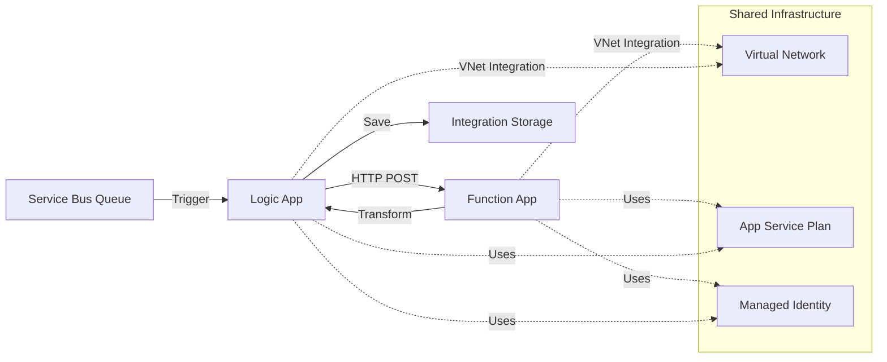

# Sample Integration - Complete Guide

This document explains the sample integration that demonstrates the complete pattern for building integrations using the common infrastructure.

## Table of Contents

- [Overview](#overview)
- [Architecture](#architecture)
- [Components](#components)
- [Prerequisites](#prerequisites)
- [Deployment](#deployment)
- [Testing](#testing)
- [How It Works](#how-it-works)
- [Customization](#customization)

## Overview

The sample integration demonstrates an end-to-end message processing flow:

1. **Service Bus Queue** receives incoming messages
2. **Logic App** orchestrates the workflow
3. **Function App** transforms the message format
4. **Storage Account** stores the transformed messages

### Integration Flow

```
Incoming Message
     ↓
Service Bus Queue (incoming-messages)
     ↓
Logic App (MessageOrchestrator)
     ├→ Calls Function App (TransformMessage)
     ├→ Saves transformed message to Storage (transformed-messages/)
     └→ Saves errors to Storage (errors/) if failed
```

## Architecture



## Components

### Infrastructure Components

#### Integration-Specific Resources (in `edmo-dev-sample-rg`)

| Resource | Name Example | Purpose |
|----------|--------------|---------|
| **Service Bus Namespace** | `edmodscsamplesb` | Message queuing |
| **Service Bus Queue** | `incoming-messages` | Receives incoming messages |
| **Function App** | `edmo-dev-sdc-sample-func` | Message transformer (.NET 8) |
| **Logic App Standard** | `edmo-dev-sdc-sample-logic` | Workflow orchestrator |
| **Integration Key Vault** | `edmodscsamplekv` | Integration-specific secrets |
| **Function Storage** | `edmodscsamplest` | Function App runtime storage |
| **Archive Storage** | `edmodscsamplestarc` | Long-term message archival |

#### Shared Common Resources (from `edmo-dev-common-rg`)

| Resource | Name Example | Purpose |
|----------|--------------|---------|
| **App Service Plan** | `edmo-dev-sdc-plan` | Hosts Function & Logic Apps |
| **Virtual Network** | `edmo-dev-sdc-vnet` | Network isolation |
| **Managed Identity** | `edmodscid` | Authentication |
| **Common Key Vault** | `edmodsctkv` | Shared secrets |
| **Common Storage** | `edmodscst` | Shared config/logs |

**Architecture Note**: Each integration gets its own Key Vault and storage accounts for isolation, but shares networking, compute, and identity resources for efficiency.

### Application Components

#### 1. Function App - Message Transformer

**Location**: `src/sample-integration/function-app/`

**Language**: C# .NET 8 Isolated

**Function**: `TransformMessage` (HTTP Trigger)

**Purpose**:
- Receives order messages in one format
- Transforms to a standardized format
- Enriches with metadata
- Returns transformed JSON

**Input Example**:
```json
{
  "id": "ORD-001",
  "customerName": "acme corp",
  "orderNumber": "PO-12345",
  "amount": 1500.50,
  "currency": "EUR",
  "items": [
    {
      "productId": "PROD-001",
      "description": "Widget A",
      "quantity": 10,
      "price": 50.00
    }
  ]
}
```

**Output Example**:
```json
{
  "id": "a1b2c3d4-...",
  "originalId": "ORD-001",
  "processedAt": "2025-10-21T12:30:00Z",
  "data": {
    "customerName": "ACME CORP",
    "orderNumber": "PO-12345",
    "amount": 1500.50,
    "currency": "EUR",
    "items": [
      {
        "productCode": "PROD-001",
        "description": "Widget A",
        "quantity": 10,
        "unitPrice": 50.00,
        "totalPrice": 500.00
      }
    ],
    "totalItems": 1,
    "totalQuantity": 10
  },
  "metadata": {
    "source": "ServiceBus",
    "transformedBy": "MessageTransformer",
    "version": "1.0"
  }
}
```

#### 2. Logic App - MessageOrchestrator

**Location**: `src/sample-integration/logic-app/MessageOrchestrator/`

**Type**: Logic App Standard (Stateful)

**Workflow Steps**:
1. **Trigger**: Service Bus Queue - `incoming-messages`
2. **Transform**: Call Function App HTTP endpoint
3. **Save Success**: Write to `transformed-messages/` container
4. **Complete**: Mark Service Bus message as complete
5. **Handle Error**: Write to `errors/` container (on failure)
6. **Abandon**: Put message back on queue for retry (on error)

## Prerequisites

Before deploying the sample integration:

1. ✅ **Common infrastructure deployed**
   ```bash
   # Deploy if not already done
   ./scripts/test-deployment.sh
   ```

2. ✅ **.NET 8 SDK installed** (for Function App development)
   ```bash
   dotnet --version  # Should be 8.0.x
   ```

3. ✅ **Azure CLI logged in**
   ```bash
   az login
   ```

## Deployment

### Option 1: Automated Deployment (GitHub Actions)

1. **Verify parameter files exist** (they are committed to git):
   ```bash
   ls bicep/integrations/sample-integration/parameters.*.json
   # Should show: dev, test, uat, prod parameter files
   ```

2. **Optional: Customize parameters** for your environment:
   ```bash
   # Edit to customize Service Bus SKU, tags, etc.
   vim bicep/integrations/sample-integration/parameters.dev.json
   git add bicep/integrations/sample-integration/parameters.dev.json
   git commit -m "Customize sample integration for dev"
   ```

3. **Deploy via GitHub Actions**:
   - Go to **Actions** → **Deploy Sample Integration**
   - Click **Run workflow**
   - Select environment
   - Check **What-If** to preview (optional)
   - Run workflow

4. **Monitor deployment** in Actions tab

**Note**: Parameter files are **not auto-generated** in the workflow. They use the committed files to preserve your customizations.

### Option 2: Manual Deployment (Azure CLI)

#### Step 1: Review/Customize Parameters

Parameter files are already committed to the repository. Review and customize if needed:

```bash
# Check existing parameter file
cat bicep/integrations/sample-integration/parameters.dev.json

# Customize if needed
vim bicep/integrations/sample-integration/parameters.dev.json
```

**Example customization**:
```json
{
  "parameters": {
    "serviceBusSku": {
      "value": "Premium"  // Upgrade from Standard
    },
    "tags": {
      "value": {
        "Environment": "Development",
        "Customer": "YourCompany",  // Customize
        "Project": "YourProject"     // Customize
      }
    }
  }
}
```

Common infrastructure resources are auto-discovered using naming convention.

#### Step 2: Build Function App

```bash
cd src/sample-integration/function-app

# Restore and build
dotnet restore
dotnet build --configuration Release

# Publish
dotnet publish --configuration Release --output ./publish

# Create deployment package
cd publish
zip -r ../function-app.zip .
cd ..
```

#### Step 3: Deploy Infrastructure

```bash
# Set subscription
SUBSCRIPTION_ID=$(jq -r '.subscriptions.dev.subscriptionId' config/subscriptions.json)
az account set --subscription "$SUBSCRIPTION_ID"

# Deploy integration infrastructure
az deployment sub create \
  --location swedencentral \
  --template-file bicep/integrations/sample-integration/main.bicep \
  --parameters bicep/integrations/sample-integration/parameters.dev.json \
  --name sample-integration-dev-$(date +%Y%m%d-%H%M%S)
```

#### Step 4: Deploy Function App Code

```bash
# Get Function App name from deployment
FUNCTION_APP_NAME=$(az deployment sub show \
  --name sample-integration-dev-LATEST \
  --query "properties.outputs.functionAppName.value" -o tsv)

# Deploy code
az functionapp deployment source config-zip \
  --resource-group customer-dev-sample-rg \
  --name $FUNCTION_APP_NAME \
  --src function-app.zip
```

#### Step 5: Deploy Logic App Workflow

```bash
# Get Logic App name
LOGIC_APP_NAME=$(az deployment sub show \
  --name sample-integration-dev-LATEST \
  --query "properties.outputs.logicAppName.value" -o tsv)

# Prepare workflow package
cd src/sample-integration/logic-app
zip -r ../logic-app.zip .

# Deploy using Azure CLI
az logicapp deployment source config-zip \
  --resource-group customer-dev-sample-rg \
  --name $LOGIC_APP_NAME \
  --src ../logic-app.zip
```

## Testing

### Test Message Flow

#### 1. Send Test Message to Service Bus

```bash
# Get Service Bus connection details
SB_NAME=$(az servicebus namespace list \
  --resource-group customer-dev-sample-rg \
  --query "[0].name" -o tsv)

# Send test message
az servicebus queue message send \
  --namespace-name $SB_NAME \
  --queue-name incoming-messages \
  --body '{
    "id": "TEST-001",
    "customerName": "test customer",
    "orderNumber": "PO-99999",
    "amount": 100.00,
    "currency": "EUR",
    "items": [{
      "productId": "TEST-PROD",
      "description": "Test Product",
      "quantity": 1,
      "price": 100.00
    }]
  }'
```

#### 2. Monitor Logic App Execution

```bash
# Get Logic App URL
LOGIC_APP_URL=$(az functionapp show \
  --resource-group customer-dev-sample-rg \
  --name $LOGIC_APP_NAME \
  --query "defaultHostName" -o tsv)

echo "Logic App Portal: https://portal.azure.com/#resource/subscriptions/.../workflows/MessageOrchestrator"
```

**Or view in Azure Portal**:
1. Go to Logic App
2. Click "Workflows" → "MessageOrchestrator"
3. View "Run History"

#### 3. Verify Transformed Message in Storage

```bash
# Get storage account name
STORAGE_NAME=$(az storage account list \
  --resource-group customer-dev-sample-rg \
  --query "[?contains(name, 'sample')].name" -o tsv)

# List transformed messages
az storage blob list \
  --account-name $STORAGE_NAME \
  --container-name transformed-messages \
  --output table \
  --auth-mode login
```

#### 4. Download and View Message

```bash
# Download latest transformed message
LATEST_BLOB=$(az storage blob list \
  --account-name $STORAGE_NAME \
  --container-name transformed-messages \
  --auth-mode login \
  --query "sort_by([],& properties.createdOn)[-1].name" -o tsv)

az storage blob download \
  --account-name $STORAGE_NAME \
  --container-name transformed-messages \
  --name "$LATEST_BLOB" \
  --file transformed-message.json \
  --auth-mode login

cat transformed-message.json | jq '.'
```

### Test Function App Directly

```bash
# Get Function App URL
FUNCTION_URL=$(az functionapp show \
  --resource-group customer-dev-sample-rg \
  --name $FUNCTION_APP_NAME \
  --query "defaultHostName" -o tsv)

# Get function key
FUNCTION_KEY=$(az functionapp function keys list \
  --resource-group customer-dev-sample-rg \
  --name $FUNCTION_APP_NAME \
  --function-name TransformMessage \
  --query "default" -o tsv)

# Test directly
curl -X POST "https://$FUNCTION_URL/api/TransformMessage?code=$FUNCTION_KEY" \
  -H "Content-Type: application/json" \
  -d '{
    "id": "TEST-002",
    "customerName": "direct test",
    "orderNumber": "PO-88888",
    "amount": 250.00,
    "currency": "USD",
    "items": [{
      "productId": "DIR-TEST",
      "description": "Direct Test",
      "quantity": 5,
      "price": 50.00
    }]
  }'
```

## How It Works

### Step-by-Step Flow

1. **Message Arrives**
   - External system sends JSON message to Service Bus Queue
   - Message sits in `incoming-messages` queue

2. **Logic App Triggers**
   - Logic App polls Service Bus queue
   - Retrieves message from queue
   - Workflow instance starts

3. **Transform Message**
   - Logic App calls Function App HTTP endpoint
   - Sends message body as JSON POST
   - Function App:
     - Parses input JSON
     - Transforms format (uppercase customer, calculate totals, etc.)
     - Returns transformed JSON

4. **Save to Storage** (Success Path)
   - Logic App receives transformed message
   - Saves to `transformed-messages/YYYYMMDD/HHmmss-{guid}.json`
   - Completes Service Bus message (removes from queue)

5. **Handle Errors** (Failure Path)
   - If transformation fails:
     - Logic App catches error
     - Saves error details to `errors/` container
     - Abandons Service Bus message (goes back to queue for retry)

### Security & Authentication

- **Managed Identity** used for all Azure service connections
- **No connection strings** or keys in application code
- **VNet Integration** for Function and Logic Apps
- **Multiple Key Vaults** for secrets isolation:
  - **Integration Key Vault** (`edmodscsamplekv`): Stores integration-specific secrets
    - Function storage keys and connection strings
    - Archive storage keys and connection strings
  - **Common Key Vault** (`edmodsctkv`): Stores shared secrets
    - `blobConnectionString`: Auto-created for common storage access
- **RBAC roles** automatically assigned:
  - Service Bus Data Receiver
  - Service Bus Data Sender
  - Storage Blob Data Contributor
  - Key Vault Secrets User

### Network Integration

Both Function App and Logic App are integrated with the shared VNet:
- Connected to `integration-subnet`
- Outbound traffic goes through NAT Gateway
- Can access private endpoints

## Customization

### Modify Transformation Logic

Edit `src/sample-integration/function-app/TransformMessage.cs`:

```csharp
// Add custom transformation logic
var transformedMessage = new TransformedMessage
{
    // Your custom fields
    CustomField = inputMessage.SomeValue,
    // ...
};
```

Rebuild and redeploy:
```bash
cd src/sample-integration/function-app
dotnet publish -c Release -o ./publish
# Then redeploy
```

### Modify Workflow

Edit `src/sample-integration/logic-app/MessageOrchestrator/workflow.json`:

**Add custom actions, conditions, loops, etc.**

Example - Add email notification:
```json
"Send_Email": {
  "type": "ApiConnection",
  "inputs": {
    "host": {
      "connection": {
        "referenceName": "office365"
      }
    },
    "method": "post",
    "path": "/v2/Mail"
  },
  "runAfter": {
    "Save_to_Storage": ["Succeeded"]
  }
}
```

### Add More Queues

Edit `bicep/integrations/sample-integration/main.bicep`:

```bicep
queues: [
  {
    name: 'incoming-messages'
  },
  {
    name: 'priority-messages'  // Add new queue
  }
]
```

### Change Storage Containers

Edit `bicep/integrations/sample-integration/main.bicep`:

```bicep
containers: [
  {
    name: 'input-messages'
  },
  {
    name: 'transformed-messages'
  },
  {
    name: 'errors'
  },
  {
    name: 'archive'  // Add new container
  }
]
```

## Troubleshooting

### Logic App Not Triggering

**Check**:
1. Logic App is enabled
2. Service Bus connection is configured
3. Managed Identity has RBAC roles

```bash
# Check Logic App status
az logicapp show \
  --resource-group customer-dev-sample-rg \
  --name $LOGIC_APP_NAME \
  --query "state"

# Should be "Running"
```

### Function App Not Responding

**Check**:
1. Function App is running
2. Code is deployed
3. VNet integration is configured

```bash
# Restart Function App
az functionapp restart \
  --resource-group customer-dev-sample-rg \
  --name $FUNCTION_APP_NAME

# View logs
az functionapp log tail \
  --resource-group customer-dev-sample-rg \
  --name $FUNCTION_APP_NAME
```

### Messages Not Transforming

**Check**:
1. Message format matches expected input
2. Function App logs for errors
3. Logic App run history

```bash
# View Function App logs in Azure Portal
# Or stream logs
az webapp log tail \
  --resource-group customer-dev-sample-rg \
  --name $FUNCTION_APP_NAME
```

## Next Steps

After deploying the sample integration:

1. **Test end-to-end** with sample messages
2. **Monitor** in Azure Portal
3. **Customize** for your use case
4. **Clone pattern** for new integrations
5. **Add Application Insights** for advanced monitoring

## Summary

The sample integration demonstrates:

✅ Complete integration pattern
✅ Using shared common infrastructure
✅ VNet integration for security
✅ Managed Identity for authentication
✅ Error handling and retry logic
✅ Infrastructure as Code with Bicep
✅ CI/CD with GitHub Actions

Use this as a template for building your own D365 F&O integrations!
